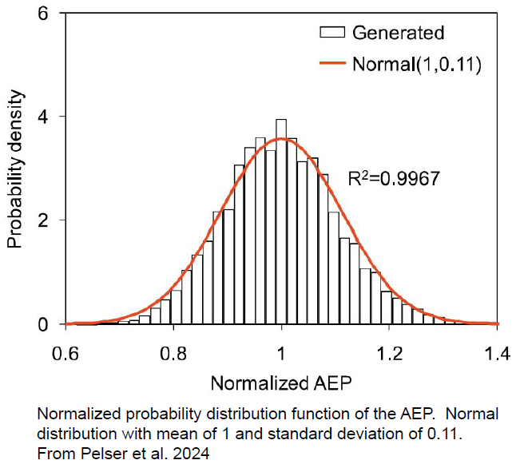
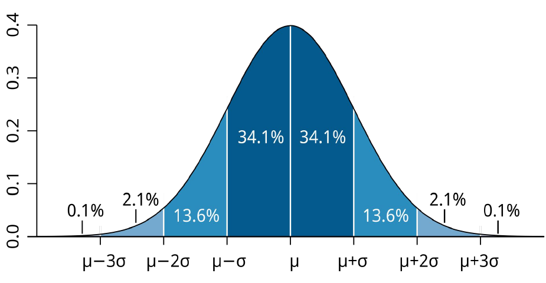
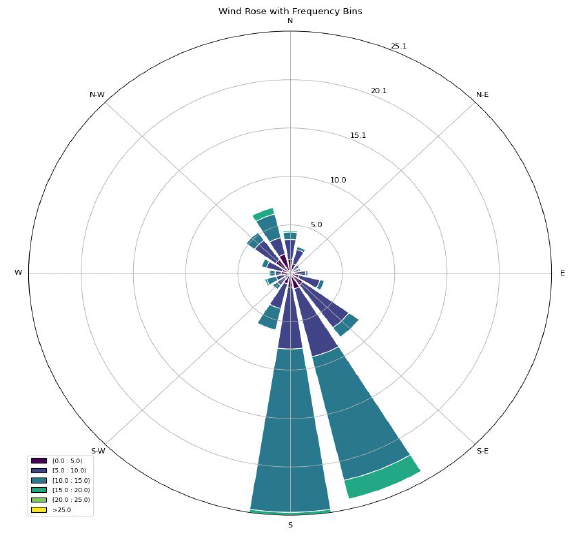
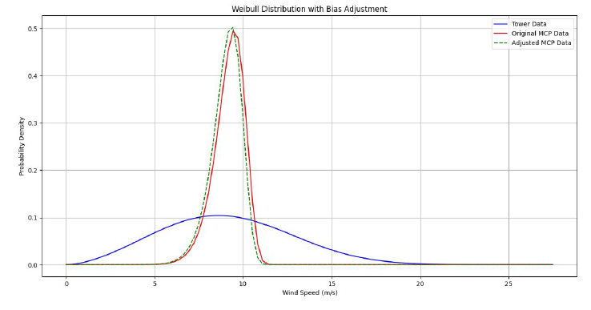
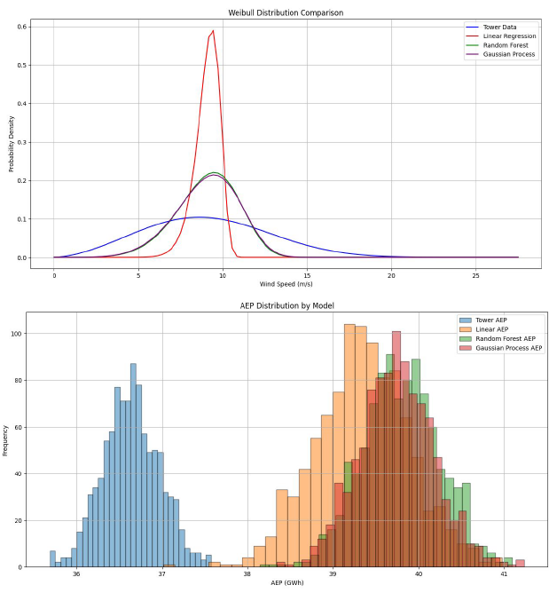
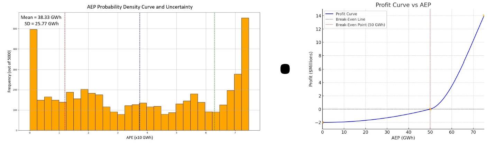

# 🌬️ Wind Energy Resource Assistant

A data-driven assistant that evaluates wind energy potential using statistical modeling, uncertainty quantification, and regression-based energy projections. This tool helps consultants and developers assess the **financial viability of wind farms**, especially when negotiating large-scale projects with banks.

---

## 📌 Project Objective

To answer the question: **"How much is a $400K wind energy study worth?"**  
We develop a workflow that predicts **Annual Energy Production (AEP)**, quantifies uncertainty (P90, P95), and evaluates the financial value of wind energy assessments.

This work was completed for **MAE 579 (Wind Energy)** at Arizona State University.

---

## 📊 Features and Methodology

### ✅ Wind Data Handling
- Short-term tower measurements (15-min resolution)
- Long-term hourly data from **GridMET (2000–2023)**

### ✅ MCP (Measure-Correlate-Predict)
- Correlates tower and GridMET data
- Predicts site-specific wind speed using regression

### ✅ Weibull Distribution + Monte Carlo Simulation
- Used to estimate probabilistic AEP
- Enables P90/P95 financial risk analysis

### ✅ Uncertainty Modeling
- Models uncertainty from:
  - Measurement noise
  - Wind shear extrapolation
  - Turbine efficiency variability
- Combines these into overall AEP confidence intervals

### ✅ Regression Models
- Linear Regression (baseline)
- Random Forest
- Gaussian Process Regression

---

## 📁 Repository Structure

| File | Description |
|------|-------------|
| `MCP.py` | Performs MCP-based wind resource prediction and AEP estimation |
| `Uncertainty_analysis.py` | Monte Carlo-based modeling of wind shear, turbine efficiency, and measurement uncertainty |
| `MCP vs tower data.py` | Compares tower data with MCP predictions and fits Weibull distribution |
| `Gridmet_WindData.py` | Loads and preprocesses long-term hourly wind data |
| `MCP Analysis_models.py` | Fits regression models to predict AEP, calculates KL divergence, bias, and variance |
| `FP_UA_LOSSE.py` | Aggregates all forms of uncertainty and propagates them into AEP calculation |

---

## 📈 Key Results

- **Tower-based AEP:** 36.66 GWh  
- **MCP-based AEP:** 40.86 GWh (overestimated by ~11.5%)  
- **Best regression models:**  
  - Random Forest (KL divergence = 1.64)  
  - Gaussian Process (KL divergence = 1.44)  
- **Combined AEP Uncertainty:** ±26 GWh  
- **Consultant Study Value (Monte Carlo Model):** ~$2.5M/year to the company

---

## 📉 Financial Implications

| Metric | Value |
|--------|-------|
| **P90 AEP** | 3.80 GWh |
| **P95 AEP** | -6.77 GWh |
| **Study ROI (Projected)** | ~$2.5M/year |
| **Consultant cost (assumed)** | $400K |

Our analysis shows that **the true value of a high-quality wind resource study far exceeds its cost**, especially when used to support high-stakes financial decisions with banks.

---

## 🖼️ Visual Insights

### 📊 AEP Normal Distribution 

  
The standard deviation of energy output (~11%) forms the statistical foundation for risk-based decisions like P90 and P95.

---

### 📉 P90 and P95 Thresholds 

  
Banks use P90 (mean - 1.34σ) and P95 thresholds to determine whether a wind project qualifies for financing.

---

### 🔁 Monte Carlo Workflow 

  
Shows how wind speed data is processed via Weibull distribution, turbine power curves, and stochastic sampling to predict AEP.

---

### ⚖️ MCP vs Tower AEP Comparison 

  
MCP predictions inflated wind speed and AEP by ~11.5% compared to conservative tower measurements.

---

### 🤖 Regression Model Accuracy 

  
Random Forest and Gaussian Process models achieved lowest KL divergence, bias, and variance, making them most reliable.

---

### 💰 Study Value Estimation 

  
Our financial model shows that a consultant’s $400K study can produce ~$2.5M/year in operational value, justifying its ROI.

---

## 📚 References

- Pelser et al., *Advances in Applied Energy*, 2024  
- S. D. Kwon, *Applied Energy*, 2010  
- AWEA 2008 - GH Energy Validation  
- [Normal Distribution – Wikipedia](https://en.wikipedia.org/wiki/Normal_distribution)  
- [LiDAR Uncertainty Modeling – DTU](https://e-windlidar.windenergy.dtu.dk/reports/sd-dd-uncertainty/)

---

## 👨‍💻 Contributors

- **Tarun Vasudevan**  
- **Wei Xiong**  

---

## 📍 Institution

**MAE 579 – Wind Energy**  
Ira A. Fulton Schools of Engineering  
Arizona State University

---

## 🔗 Future Work

- Integrate Lidar-based wind profiles  
- Expand to multi-site simulation  
- Couple with economic models for real-time bidding and grid valuation
